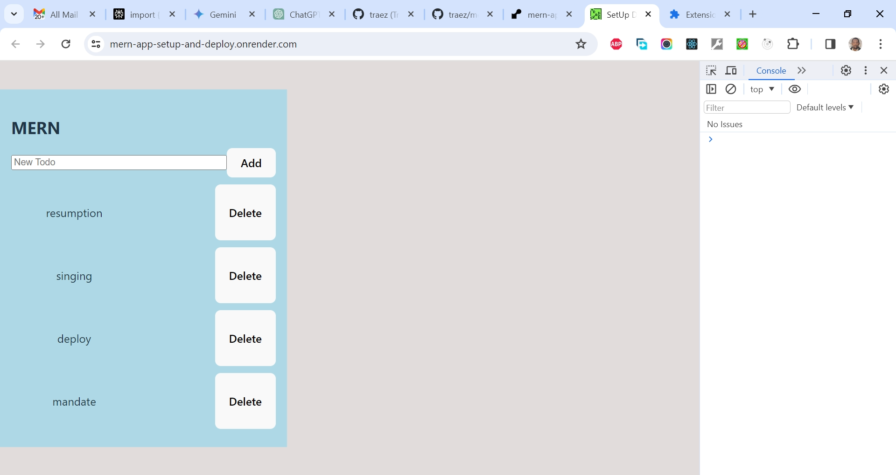

# Anjan Shomodder's setup and deploy fullstack(MERN) application Project

This is a solution to the [Anjan Shomodder's setup and deploy fullstack(MERN) application Project](https://www.youtube.com/watch?v=ME3tMy5Q2qo). I'm testing my hand creating very simple (follow along) projects for now to get familiar with the matter. 

## Table of contents

- [Overview](#overview)
  - [The challenge](#the-challenge)
  - [Screenshot](#screenshot)
  - [Links](#links)
  - [My process](#my-process)
  - [Built with](#built-with)
  - [What I learned](#what-i-learned)
  - [Continued development](#continued-development)
  - [Useful resources](#useful-resources)
  - [Author](#author)
  - [Acknowledgments](#acknowledgments)

## Overview

### The Challenge/User Stories

In this video, you will learn how to set up and deploy full-stack (MERN) applications on Vercel and Render.  

### Screenshot

### Links

- Solution URL: [https://github.com/traez/mern-app-setup-and-deploy](https://github.com/traez/mern-app-setup-and-deploy)
- Live Site URL: [https://mern-app-setup-and-deploy.onrender.com/](https://mern-app-setup-and-deploy.onrender.com/)

## My process

### Built with

- Semantic HTML5 markup 
- CSS custom properties 
- Flexbox 
- CSS Grid 
- Mobile-first workflow 
- [React](https://reactjs.org/) - JS library 
- [Next.js](https://nextjs.org/) - React framework (No)
- Tailwind CSS  
- Typescript (No)
- Nodejs
- Expressjs
- MongoDB

### What I learned

- Didn't write READMe on first build, only attempting this now after several refactors. But be rest assured that this was very useful!    

### Continued development

- More increasingly complex MERN stack projects. 

### Useful resources

Stackoverflow  
YouTube  
Google  
ChatGPT

## Author

- Website - [Trae Zeeofor](https://github.com/traez)
- Twitter - [@trae_z](https://twitter.com/trae_z)

## Acknowledgments

To all MERN stack Developers and Content Creators. Well done!.
